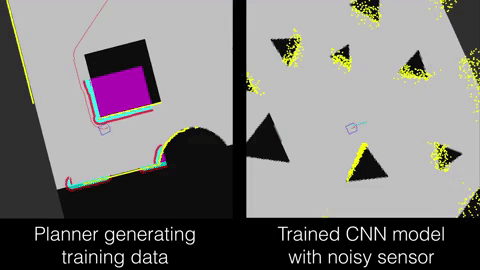
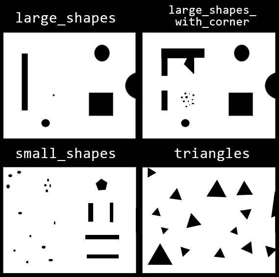

# cnn-robot-navigation
Supervised learning robot navigation to random goals in Python/Tensorflow and ROS. A trained model drives a robot based only on input from a simulated laser rangefinder, and the relative distance and orientation of a goal pose.

This project is an implementation of a CNN and required ROS (Robot Operating System) configurations described in:

[M. Pfeiffer, M. Schaeuble, J. Nieto, R. Siegwart, C. Cadena. (2017).
”From Perception to Decision: A Data-driven Approach to End-to-end Motion Planning for Autonomous
Ground Robots” in IEEE International Conference on Robotics and Automation (ICRA), 2017.](https://arxiv.org/abs/1609.07910)

I made this for a graduate robotics course in 2018, and I made a Docker container for the ROS dependencies in 2020 and finally put this up on GitHub (ROS versions require specific versions of Ubuntu). There are a few hacky things with the ROS stuff that I did for getting it up and running quickly. I was mostly interested in doing the supervised learning, and I do not have access to an actual robot. However, the focus of this documentation is to explain how to use the ROS component, since that is the most obscure part (the Docker container is a big help here, though).



## Credits

The launch files and cost paramters under `robot_nav/` are adapted from the example launch files and maps in the [ROS navigation tutorials](https://github.com/ros-planning/navigation_tutorials) navigation_stage part, incorporating some fixes by czyapp (https://github.com/czyapp/navigation_tutorials).

The robot and sensor .world files (which describe the shape of the robot and specify the laser rangefinder) are adapted from course materials for 6912 Autonomous Robotics by [Dr. Andrew Vardy](http://bots.cs.mun.ca/).

## Requirements
To train a model:
* TensorFlow 1.9 (other 1.x versions may work for training, but haven't been tested) and matching CUDA and CuDNN versions (see https://www.tensorflow.org/install/gpu)

To generate training data or run a trained model:
* Docker (https://www.docker.com/)
* If on a Windows host machine, an XServer application for Windows. I used [VcXsrv](https://sourceforge.net/projects/vcxsrv/), as suggested in [this guide](https://jack-kawell.com/2019/09/11/setting-up-ros-in-windows-through-docker/) by Jack Kawell.
* I haven't been able to test the GUI XServer configurations on a Linux host, but there are instructions [here](http://wiki.ros.org/docker/Tutorials/GUI) and other places.

## Setup instructions

The robot simulation is run in [ROS Kinetic](http://wiki.ros.org/kinetic) through a Docker container. The rviz simulator GUI needs to be able to display, so we have to use XServer to run the GUI windows on the host.

Build the Docker image (from the `robot_nav/` directory):
```shell
docker build --tag robot_nav .
```

Run the container with:
```shell
docker run --mount type=bind,src="$(pwd)"/../training_data,dst=/home/data --mount type=bind,src="$(pwd)"/../exported_models,dst=/home/models -it --name robot_nav robot_nav
```
This creates a directory called `training_data` in the project root if it doesn't exist, which is mounted in the container as `/home/data` and will be populated with any training data generated. Also the `exported_models` directory is mounted in the container as `/home/models` so that any models there can be used to drive the robot.

Alternatively, if on a Linux host, some other options probably need to be added to the `docker run` command for XServer, as decribed [here](http://wiki.ros.org/docker/Tutorials/GUI).

(Windows only) Once in the container run this with the correct ip address for using the host XServer:
```shell
echo 'export DISPLAY=<insert_host_ip_address>:0.0' >> ~/.bashrc
```

Then to source everything for all instances of bash and activate the Python virtual environment with TensorFlow:
```shell
source ~/.bashrc
source ./venv/bin/activate
```

In a second terminal open up a bash shell in the container and run `roscore`, which is required for the ROS functionality:
```shell
docker exec -it robot_nav bash
roscore
```

### Control robot with a trained CNN model

All commands here can be made in the first terminal described above.

To launch the rviz simulator in a map with the CNN controller:
```shell
roslaunch robot_nav map_with_cnn.launch map_name:=triangles noisy:=true model_dir:=/home/models/sample_model
```
Change the map by changing "triangles" to one of the other maps. The noisy parameter makes the laser scan data noisy. It can be set to false. The model_dir parameter should point to a directory with an exported model in it.

To launch the simulator with the ROS navigation stack DWA planner driving the robot:
```shell
roslaunch robot_nav map_with_planner.launch map_name:=large_shapes_with_corner noisy:=false record_data:=true
```
The new parameter here is `record_data`, which will write to a CSV file in `/home/data` if set to true. The CSV filename includes the map name and start time, and new files are started every 100k lines.

### Train CNN

*This section is incomplete, but the documentation at the top of `/cnn_learning/cnn_stage_laser.py` should be sufficient to run it.*

## How it works

In the paper this work is based off the authors trained a neural network to learn to drive a robot based only on a laser sensor and a goal pose and its location relative to the robot. They trained their network (a CNN) with supervised learning using data gathered from a ROS simulator using the ROS 2D navigation stack (which uses cost grids and simulations to generate steering commands). Then they evaluated their trained network in the simulator AND with a real robot driving around an office space.

I don't have a real robot, and I didn't write anything to evaluate the simulated driving performance (Pfeiffer et. al. measured final distance to goal, translational energy, travelled distance, rotational energy and the travel
time). I did make several maps to test on, and included an easy parameter to turn on sensor noise. I found that the trained model works fine on unseen maps with sensor noise.

In this implementation the network is the same as in the paper. The new code I wrote for the ROS component was mainly Python nodes to:
1. generate goals poses for the planner or CNN controller to drive the robot to (goals are placed not too close to walls),
2. record the data when the navigation stack planner is driving, and
3. drive the robot using the CNN for inference to get steering orders.

### Maps

One hacky thing I did was re-use the settings from the willow-full world in the navigation_stage tutorial. Rather than figure out how to change the map size and change the robot's starting location, I just made my maps the same size (but with a large walled off area) and made sure the starting coordinates are free from obstacles. There are 4 maps included with this project, pictured below. In the `large_shapes_with_corners` map the robot sometimes gets stuck while trying to get around the L-shaped object (both with the planner and with the CNN controller).


